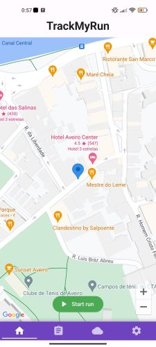
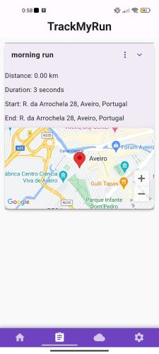
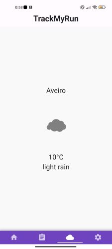

# TrackMyRun

Imagine an app that not only tracks your runs but also makes them memorable. With TrackMyRun, you can save the history of your runs and even associate photos with them - capturing that amazing and motivating moment along the way.

Before heading out for your next adventure, check the weather in your area directly in the app on the "Weather" tab. This way, you'll always be prepared, whether you're facing scorching sun or running in refreshing rain.

With TrackMyRun, each run becomes a unique and exciting experience.

##

Bernardo Pinto - 1005926 (50%)

João Santos - 110555 (50%)


## How to run

- To run you need a Google Maps API key, which you can put in the [AndroidManifest.xml](projeto/android/app/src/main/AndroidManifest.xml) file.
```xml
<application android:label="TrackMyRun" android:requestLegacyExternalStorage="true" android:icon="@mipmap/ic_launcher">
        
        <!-- TODO: Add your Google Maps API key here -->
        <meta-data android:name="com.google.android.geo.API_KEY" android:value="YOUR_API_KEY_HERE"/>

</application>


```

- To install the dependencies run the following command in the root of the project:
    - `flutter pub get`
- To run the project run the following command in the root of the project:
    - `flutter run`

## Demo

### Video
- [Demo](demo/TrackMyRunDemo.mp4)

This demo was recorded on an emulator to make route creation and viewing easier.
Running on the emulator may cause some lag in the app which does not happen on a real device.

### Screenshots

| Home                          | History                          | Weather                          |
|-------------------------------|----------------------------------|----------------------------------|
|     |      |      |

Some screenshots of the app running on a real device.

## Features

-  **Track your runs**: Track your runs and save them in the app.
-  **Map**:  Users can view their route on an interactive map directly within the application.
-  **Weather**: Check the weather in your area before heading out for a run.
-  **Photos**: Associate photos with your runs to make them memorable.
-  **Statistics**: Check your run statistics

## Technologies

-  **Flutter**: 
-  **Dart**:
-  **SQLite**:

## Environment
- **sdk**: >=3.0.0 <4.0.0
- **flutter**: >=3.10.0

## APK 

- [APK](app-release.apk)


